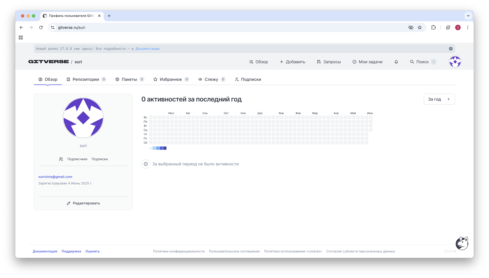
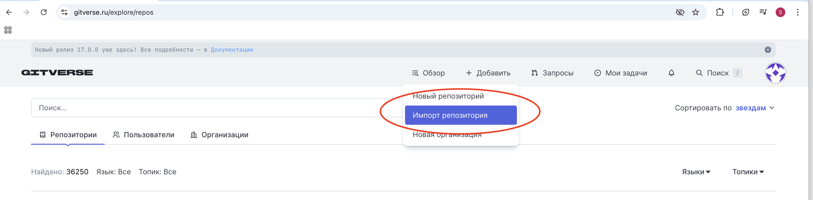
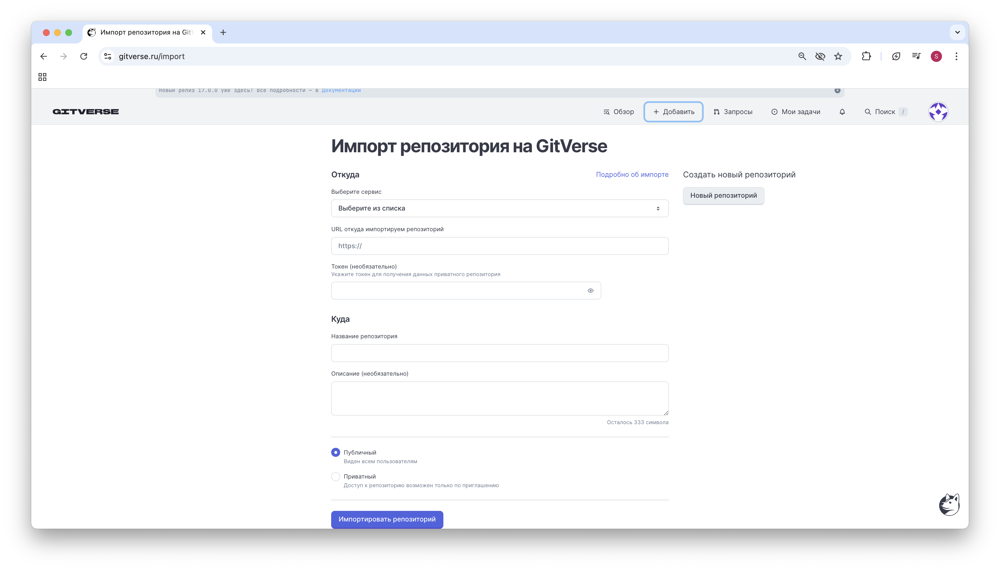
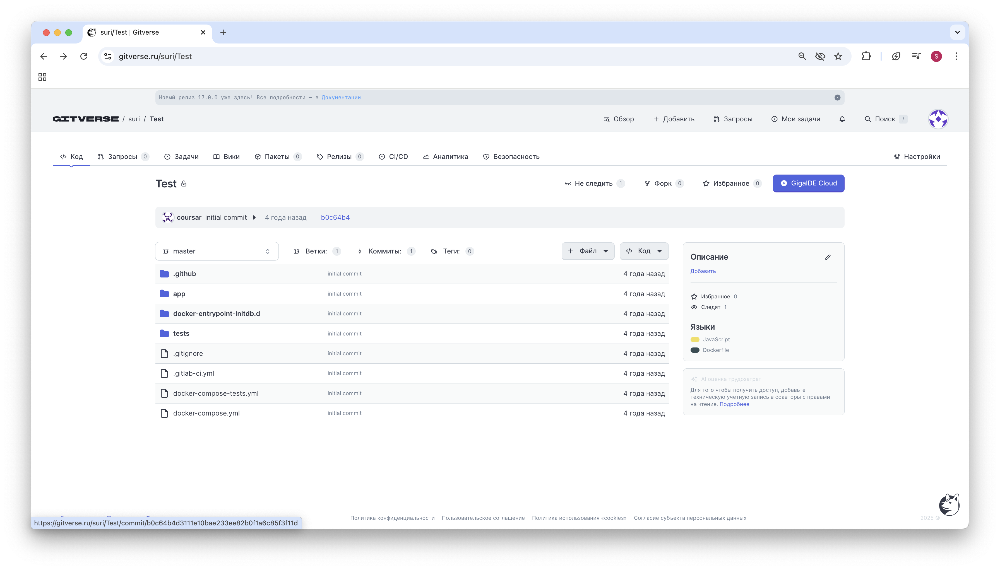
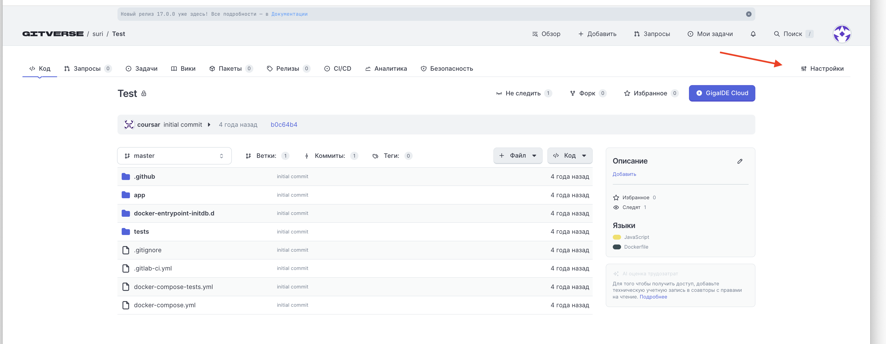
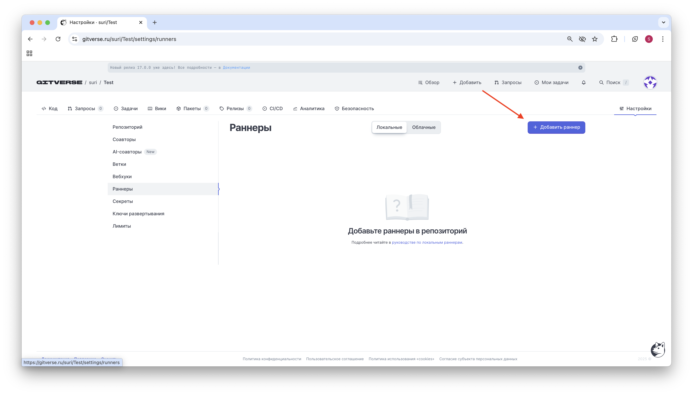
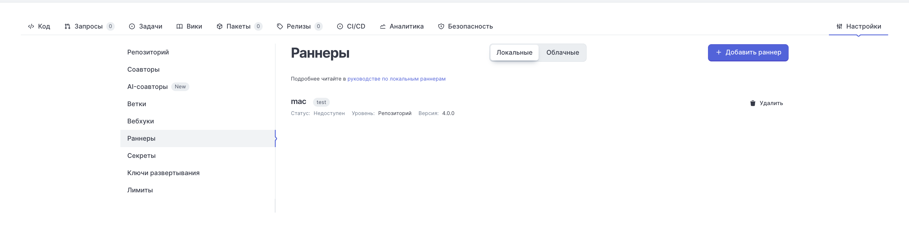

# Домашнее задание к занятию «DevSecOps и AppSec. Часть 2»

Воросы можно писатв через лиичный кабинет, а также через доску вопросов на сайте.

## Описание
Домашнее задание — лабораторная работа, в которой вы по инструкциям выполните действия.

Обратите внимание, что домашнее задание является необязательным. Его выполнение не повлияет на получение зачёта по модулю.

## Работа с GitVerse
В этом задании применяется сервис GitVerse — платформа для хостинга Git-репозиториев, контроля версий кода и совместной разработки, являющееся одним из популярных решений для поддержки DevOps и DevSecOps.

Вы будете использовать заранее подготовленные материалы для упрощения настройки и развёртывания исследуемого прриложения.

### Создание учетной записи GitVerse
1. Перейдите на домашнюю страницу [GitVerse](https://gitverse.ru/) и нажмите **Войти** или **Начать работу**:

2. Нажмите **Войти**:

3. Нажмите **Зарегистрироваться**:

4. Введите свой email, нажмите **Подтвердить** (отправить письмо с кодом) и следуйте дальнейшим инструкциям для заведения учётной записи: 

В качестве способа Дополнительной защиты выберите Двухфакторная аутентификация (по одноразовому коду).

5. Далее выбираем предпочитительный почтовый ящик (для получаения уведомлений от сервера) и имя пользователя.




### Импорт учебного проекта
Для добавления учебного проекта к себе в репозиторий небходимо:
1. На верхней панели элементов нажимаем на **+ Добавить**, **Импорт репозитория**



2. Далее выбираем сервис откуда добавляется репозиторий (github)
3. В поле **URL откуда импортируем** указываем адрес:  `https://github.com/netology-code/ib-devsecops-app.git`
Здесь надо обновить ссылку
4. В поле **Название репозиория** задаём имя репозитория. Остальные поля опциональны и не требует заполнения, поэтому пропускаем их.
5. Нажимаем на кнопку **Импортировать репозиторий**, в результате чего получаем импортированную копию учебного проекта в своём гите.


Учебный проект состоит из типового приложения nodejs и конфигурационных файлов, задающих процесс сборки.

### Сборка приложения 
Для сборки учебного проекта используем локальный раннер ([подробнее о раннерах](https://gitverse.ru/docs/knowledge-base/actions/runners/)), который необходимо [скачать](https://gitverse.ru/docs/knowledge-base/actions/runners/#%D1%81%D1%81%D1%8B%D0%BB%D0%BA%D0%B8-%D0%B4%D0%BB%D1%8F-%D1%81%D0%BA%D0%B0%D1%87%D0%B8%D0%B2%D0%B0%D0%BD%D0%B8%D1%8F), запустить и подключить к нашему проекту.

Для подключения раннера необходимо открыть настройки проекта (кнопка **Настройки**)


выбрать вкладку Раннеры и нажать кнопку **Добавить раннер** и скопировать **сгенерированный токен**, который будет использован для подключения раннера.
.

### Подключение раннера
Скачав бинарный файл раннера, делаем его исполняемым командой chmod+x и убеждаемся что он работает (запуская с ключом -version). 
Аргумент register вызывает интерактивный режим регистрации раннера, запрашивая требуемую для работы инфорацию
.
Вновь открываем настройки проекта,на вкладке раннеры появился наш раннер.
.

### Построение пайплайна
1. Пайплайн описывают в специальных конфигурационных файлов, на языке разметки yaml. Для учебного проекта определим две стадии: **build** и **deploy**, описав их в файле ci.yaml:

```
stages:
    - build-stage
    - deploy-stage

build:
    stage: build-stage
    script:
        - npm install
    artifacts:
        untracked: false
        when: on_success
        paths:
            - node_modules
            - package-lock.json

deploy:
    stage: deploy-stage 
    image: node
    script:
        - chmod +x deploy.sh
        - bash deploy.sh`
```        
На этапе **build** выполняется сборка и установка нашего приложения (команда **npm install**). 

На этапе **deploy** выполняется запуск нашего приложения c помощю следующего sh-скрипта:

```  
#! /bin/bash
# Ищем и останавливаем работающий процесс npm проверяя файл, в котором записан номер процесса, когда процесс npm уже работает

if [ -f pidfile.txt ]; then
  PID=$(cat pidfile.txt)
  kill $PID
  rm pidfile.txt
else
  echo "pidfile.txt not found. No process to stop."
fi

# Запускаем процесс npm в фоновом режиме, сохраняя номер этого процесса в файл pidfile.txt
npm start > /dev/null 2>&1 & 
PID=$!
echo "Started npm start with PID: $PID"
echo $PID > pidfile.txt

# Далее можно добавлять команды для раннера, при необходимости

# При отсутствии проблем скрипт завершится с успехом	
exit 0
```  
Убедившись что раннер успешно завершает работу переходим к следующей части
